<div align="center">

# Mosaic

Build photo collages that stay editable

[![Live][badge-site]][url-site]
[![HTML5][badge-html]][url-html]
[![CSS3][badge-css]][url-css]
[![JavaScript][badge-js]][url-js]
[![Claude Code][badge-claude]][url-claude]
[![License][badge-license]](LICENSE)

[badge-site]:    https://img.shields.io/badge/live_site-0063e5?style=for-the-badge&logo=googlechrome&logoColor=white
[badge-html]:    https://img.shields.io/badge/HTML5-E34F26?style=for-the-badge&logo=html5&logoColor=white
[badge-css]:     https://img.shields.io/badge/CSS3-1572B6?style=for-the-badge&logo=css3&logoColor=white
[badge-js]:      https://img.shields.io/badge/JavaScript-F7DF1E?style=for-the-badge&logo=javascript&logoColor=black
[badge-claude]:  https://img.shields.io/badge/Claude_Code-CC785C?style=for-the-badge&logo=anthropic&logoColor=white
[badge-license]: https://img.shields.io/badge/license-MIT-404040?style=for-the-badge

[url-site]:   https://mosaic.neorgon.com/
[url-html]:   #
[url-css]:    #
[url-js]:     #
[url-claude]: https://claude.ai/code

</div>

---

## Overview

Drop photos in, then change your mind. Switch from three columns to four, from a
grid to a heart, or from square to widescreen at any point, and every photo you
already placed stays where it belongs with its framing intact. Most collage tools
bind photos to a layout the moment you commit, so asking for a fourth column
after placing three photos means starting over.

Add captions in the classic meme style, cut a flat background out of a photo, and
export the collage or every photo as its own square thumbnail. Nothing is
uploaded anywhere.

**Live:** mosaic.neorgon.com

---

## Features

- **Change the layout whenever** -- ten layouts including grid, masonry, a scatter pile and shape outlines. Your photos and their framing carry over every time
- **Focus editor** -- open any photo full screen: erase or restore the background with soft brushes, magic-wand the colour you click, or let the automatic edge fill do the flat part. Zoom to the pixel, undo per stroke, and it all persists
- **Black & white and colour tools** -- mono and high-contrast noir presets plus brightness, contrast, saturation and warmth, baked into pixels so they work in every browser
- **Save a single photo** -- export the edited photo on its own, full working resolution, PNG with transparency or JPEG
- **One-click styles** -- seven canvas styles (clean, gallery, prints, sunset, ocean, pastel, noir), gradient backgrounds with a direction dial, photo borders with real shadows, and an all-black-&-white toggle
- **Demos drawn in the browser** -- postcards, heart, meme and gallery recipes over eight procedurally drawn sample photos. No downloads, nothing copyrighted
- **Hero cells** -- promote any photo to a 2x2 block and the rest pack around it
- **Reframe by dragging** -- drag a photo to pan it, scroll or pinch to zoom, hold shift and drag to swap two cells
- **Meme and caption text** -- Impact styling with a proper outline, six box presets, drag anywhere on the canvas
- **Batch thumbnails** -- every photo as its own square crop at 256 or 512px
- **Undo and autosave** -- full history, and your session (cutouts included) survives a reload
- **Nothing leaves the device** -- no account, no upload, no watermark, no export limit, and background removal runs on local pixels, never a service

---

## Running locally

ES modules require an HTTP server (not `file://`):

```bash
python3 -m http.server 8867
```

---

## Architecture



```
mosaic-site/
├── index.html          # shell: rails, stage, inspectors, mobile sheet tabs
├── css/style.css       # editor-light dialect tokens + app styles
└── js/
    ├── app.js          # entry point
    ├── state.js        # the model: pool, overrides, overlays, params
    ├── layouts.js      # PURE layout functions: count -> cells, never sees a photo
    ├── compose.js      # the single render path, used by preview and every export
    ├── overlays.js     # caption layer and the meme text engine
    ├── filters.js      # colour matrix baked into pixels (ctx.filter is not Baseline)
    ├── gestures.js     # stage pointer priority: overlay > zoom > swap > pan
    ├── tools.js        # automatic background removal, thumbnails, aspect fit
    ├── editor.js       # the focus editor: session, viewport, tools, undo
    ├── editor-input.js # the editor's pointer, wheel and keyboard wiring
    ├── editor-tools.js # brush stamps, wand flood fill, alpha history, cut baking
    ├── presets.js      # one-click canvas styles + the all-B&W toggle
    ├── demos.js        # demo recipes over the sample art
    ├── demo-art.js     # eight procedural sample photos, deterministic
    ├── history.js      # undo/redo over arrangement, never over bitmaps
    ├── store.js        # IndexedDB session, blobs not data URLs, cutouts included
    ├── render.js       # DOM rendering and control sync
    └── events.js       # wiring
```

**The one idea worth knowing:** a layout is a pure function of *how many* photos
there are. It receives a count, never the pool, so it cannot hold a photo even by
accident. Placement is re-derived on every change from pool order plus explicit
swaps, and framing lives on the photo rather than the cell, because cells are
rebuilt constantly and are not identity. That is why changing the layout never
loses anything.

---

<div align="center">
<sub>Part of <a href="https://neorgon.com/">Neorgon</a></sub>
</div>
