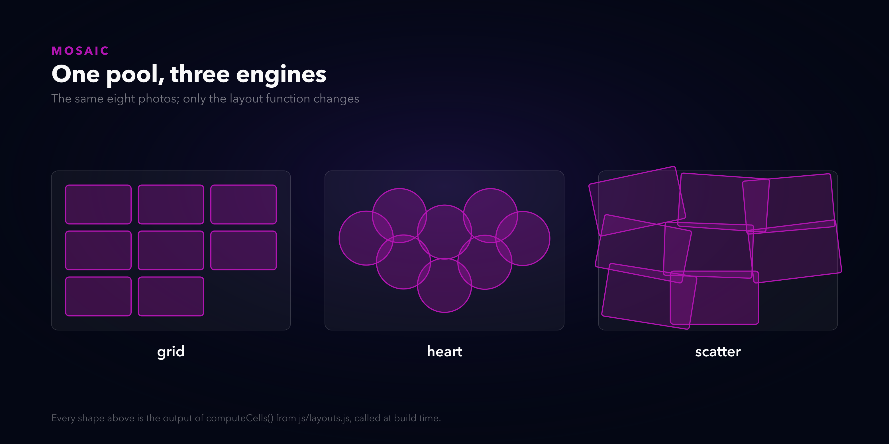
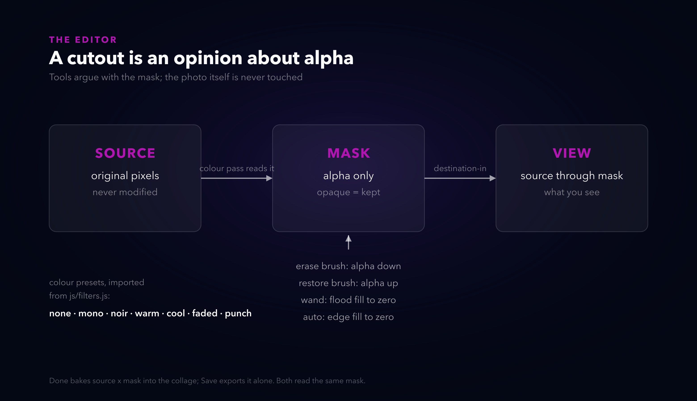
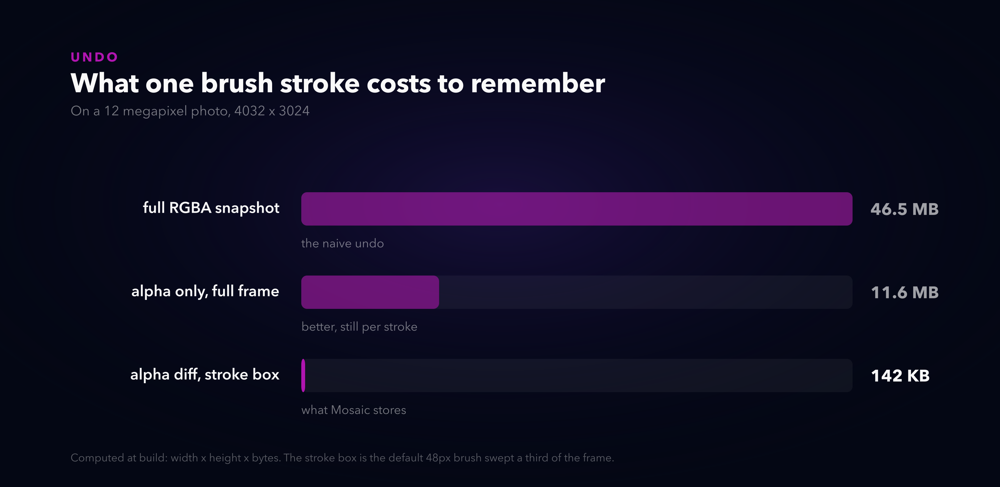

# The background remover you can argue with

*Alternate titles: "Three canvases and a mask" · "Undo is an alpha channel" · "My flood fill needed supervision"*

---

Mosaic is my collage tool. It had one Remove background button, and that button was a slot machine. Under the hood it flood-fills inward from the photo's edges: anything close enough to the edge colour goes transparent. On a product shot or a studio portrait it's honestly great. On anything else it takes a bite out of someone's shoulder, and your options were undo or live with it.

That's the part that bugged me. Not that it failed. That you couldn't argue with it.

So I built the argument: a full-screen editor where you erase and restore the background by hand, click a colour to remove it, and the automatic fill is demoted to a first draft you correct. No model, no upload, no service. Every pixel stays in the page, which was the point of the whole site to begin with.

## The tool this lives in

Quick orientation, because the editor makes more sense inside its host. Mosaic's founding rule is that a layout never owns photos. Layouts are pure functions: they get a count and return cells, and they cannot hold a photo even by accident. Your photos live in a pool, placement is re-derived on every change, and that's why switching from a grid to a heart to a pile of scattered prints loses nothing.

I like this diagram more than I should, because it can't lie. The build script imports `computeCells()` from the site's own layout module and draws whatever comes back. If I change the scatter jitter tomorrow, the diagram changes with it or the build fails. There is no version of this picture that quietly goes stale.

## A cutout is an opinion about alpha

Here's the frame that made the editor design itself. A cutout is not an edit to the photo. It's an opinion about which pixels count, and opinions should be cheap to change.

So the editor is three canvases:

The source holds the original pixels and nothing ever writes to it. The mask holds one channel of opinion: opaque means kept, transparent means gone. The view is just the source drawn through the mask with one `destination-in` composite. Every tool is a different way of arguing with the mask:

- The erase brush stamps soft-edged alpha down.
- The restore brush stamps it back up.
- The wand flood-fills the region around the colour you clicked down to zero.
- Auto is the old edge fill, writing the same mask instead of a new photo.

One detail I care about: the wand matches against the *source* colours, not the current state. Erase half the sky, then wand the other half, and the selection behaves identically both times. If it matched the working state, every erased pixel would shift what "similar" means and the tool would feel haunted.

When you hit Done, source times mask gets baked into the collage. When you hit Save, the same bake goes to a PNG with real transparency, or a JPEG flattened on white. Both read the same mask, so there is exactly one cutout and no drift between what you saw and what you got. I measured one wand click during testing at 366,194 pixels gone fully transparent with 2,319 feathered edge pixels, counted from the alpha channel, because "it looks removed" and "it is removed" are different claims.

## Undo had to be cheap or the brushes were a lie

Brush tools without per-stroke undo are a trap. And the naive undo, snapshot the canvas before each stroke, is 46 and a half megabytes per stroke on a 12 megapixel photo. Ten strokes of history and you're holding half a gigabyte for the privilege of changing your mind.

But remember what a stroke actually changes: alpha, inside the stroke's bounding box. So that's all Mosaic stores. One byte per pixel, cropped to the box the brush touched.

The bars are computed in the build script from width times height times bytes, not typed in. A typical stroke lands around 142 KB, which is why the editor can afford 25 steps of history at full working resolution without anyone noticing the cost.

Working resolution has a ceiling, and I'll get to it in the confessions.

## The Safari tax

The colour half of the editor, black and white included, has a story I inherited rather than wrote. The obvious way to do canvas filters is `ctx.filter = 'grayscale(1)'`. Mosaic's first version did exactly that, and it shipped broken on every iPhone, silently, because Safari has `ctx.filter` disabled and one-engine testing never noticed. Photos just rendered unfiltered with no error anywhere.

The fix, which predates this editor and which the editor now leans on, is doing colour by hand: a 4x5 colour matrix over `ImageData`, same maths as SVG's `feColorMatrix`. Mono and the new noir preset are the grayscale matrix, noir with a contrast push on top. The warmth slider is a diagonal matrix nudging red up and blue down. It runs everywhere because it's arithmetic, and the editor previews through that exact pipeline, so the preview cannot disagree with the export. In a photo tool that's not a nicety. That's the product keeping its word.

## But a segmentation model would be better

Someone will say it, so let's have it out. Yes, a proper model cuts hair and fur better than any flood fill ever will. Two things stopped me, and I stand by both.

First, this whole fleet is zero-build static sites, and the code already documented that decision before I touched it: shipping a WASM segmentation model is a fleet-level call, not something to smuggle into one repo. A model is megabytes of weights on a site whose entire JS currently fits in a few hundred kilobytes.

Second, and this is the real one: a model replaces your judgment, a brush extends it. When the model gets your dog's ear wrong, you're back at the slot machine, re-rolling and hoping. When the wand gets it wrong here, you zoom in and paint the truth back with the restore brush. The auto fill stays as the opening move because it's genuinely good on flat backdrops. The brushes exist because "good on flat backdrops" was never the whole job.

## Where it breaks

Hair and foliage. The wand and the fill are geometric, not semantic, and the code's own comment says it plainly: strong on flat backdrops, weak on hair. The soft brushes get you further than the old one-shot ever could, but a backlit haircut is still an honest fifteen minutes of work.

Big photos get a capped working copy. Above 4200 pixels on the long edge, the editor downscales before editing, because three full-resolution RGBA buffers of a 48 megapixel shot is over half a gigabyte of pixels. Every phone photo I own edits at native resolution; a medium-format scan doesn't.

Saves are heavier than they should be. Cutouts persist to IndexedDB so a reload can't eat your brushwork, but the save path rewrites photo blobs more eagerly than it needs to. It was already shaped that way before cutouts existed and the cutouts made it heavier. Known, written down, not fixed yet.

And two browser tabs of Mosaic will overwrite each other's autosave, last writer wins. That one predates all of this. It's on the list.

---

**Live:** [mosaic.neorgon.com](https://mosaic.neorgon.com) · The sample photos in the demos are canvas drawings generated in the browser, so nothing in them is anyone's stock. Diagrams are built by a script that imports the site's own modules; the numbers you see are computed, not remembered.
